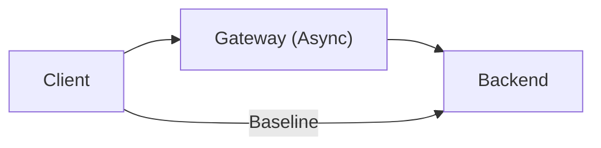

# grpc-boundary-lab

Exploring the performance impact of introducing a gRPC gateway boundary in front of a backend service.

This project measures:

- Throughput degradation
- Tail latency amplification (p95 / p99)
- Saturation behavior under load

**Live Documentation:** [https://AndySchubert.github.io/grpc-boundary-lab/](https://AndySchubert.github.io/grpc-boundary-lab/)

---

## Architecture



The **Gateway** is implemented using asynchronous gRPC stubs to minimize overhead and prevent thread starvation. This lab quantifies the cost of this additional hop, including serialization, network, and scheduling overhead.

---

### Prerequisites
- **Java 21+** (Backend, Gateway, and Load Generator)
- **Gradle** (via wrapper — `./gradlew`)
- **Makefile** (for orchestration and sweeps)
- **(Optional) Python 3.12 + Poetry** — only if you want to preview/build the documentation

## Installation & Setup
1. **Build all modules**:
   ```bash
   make build
   ```
2. **Setup Loadgen (Python)**:
   ```bash
   poetry install
   ```

---

## Quick Start

1. **Build all modules:**
   ```bash
   make build
   ```

2. **Run tests:**
   ```bash
   make test
   ```

3. **Start backend:**
   ```bash
   make backend
   ```

4. **Start gateway:**
   ```bash
   make gateway
   ```

5. **Run load sweep (automated):**
   ```bash
   make sweep REQUESTS=50000 CONCURRENCY="1 16 64"
   ```

---

## Performance Tuning

Both the backend and gateway support thread pool tuning via environment variables:

- `BACKEND_THREADS`: fixed thread pool size for the backend server.
- `GATEWAY_SERVER_THREADS`: thread pool size for the gateway's ingress server.
- `GATEWAY_CLIENT_THREADS`: thread pool size for the gateway's outbound client channel.

Examples:
```bash
BACKEND_THREADS=64 make backend
GATEWAY_SERVER_THREADS=64 GATEWAY_CLIENT_THREADS=64 make gateway
```

---

## Documentation

Full documentation including detailed architecture diagrams and analysis is available via MkDocs:

- **Online:** [Live Link](https://AndySchubert.github.io/grpc-boundary-lab/)
- **Local:** `make docs`

---

## Status

- ✅ **Asynchronous Gateway**: High-throughput forwarding.
- ✅ **Tunable Threading**: Optimize for specific hardware.
- ✅ **Automated Load Generator**: Percentile latency (HdrHistogram).
- ✅ **Integration Tests**: Automated verification via `make test` and CI.
- ✅ **CI/CD**: Automated testing and documentation deployment.

