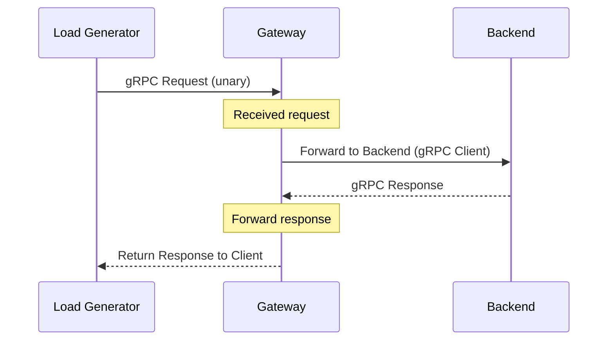

# Request Flow

This page details the journey of a gRPC request through the system.

## Unary Call Path

## Forwarding Logic

The Gateway uses a `PingServiceClient` to proxy requests to the backend. For each incoming request, it:

1. Receives the incoming `PingRequest`.
2. Calls the backend's `Ping` RPC via the client stub.
3. Returns the backend's response (or wraps any error).

This design leverages Go's goroutine-per-request model — each inbound gRPC call is handled in its own goroutine, allowing the gateway to serve thousands of concurrent requests efficiently.