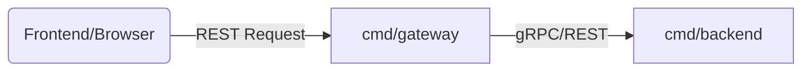

# Frontend Architecture

The frontend is a modern React application designed to interact with the gRPC/REST gateway and visualize performance benchmarks.

## Technology Stack
- **Framework**: [React](https://reactjs.org/) with [TypeScript](https://www.typescriptlang.org/).
- **Build Tool**: [Vite](https://vitejs.dev/) for fast development and optimized builds.
- **HTTP Client**: [Axios](https://axios-http.com/) for all API communication.
- **Styling**: Tailwind CSS (assumed based on project structure and common patterns).

## Key Components

### 1. API Service Layer (`src/services/api.ts`)
Encapsulates all communication with the backend gateway. It provides methods to:
- Test the "Ping" endpoint.
- Fetch current system mode/configuration.
- Retrieve the latest benchmark results.

The service is designed to pass parameters (`target`, `tls`) that tell the gateway how to communicate with the backend service.

### 2. State Management
- Utilizes React Hooks (`src/hooks`) for local state and data fetching logic.
- Managed types in `src/types` ensure consistency with the backend API responses.

### 3. Page Structure (`src/pages`)
- Organized into functional pages (e.g., Dashboard or Benchmark View) that orchestrate components to display data.

## Communication Pattern
The frontend communicates exclusively with the **Gateway** via its REST interface. It does not talk to the backend service directly. This allows the frontend to trigger different backend communication protocols (gRPC vs REST) by simply changing request parameters.

## Environment Configuration
The frontend uses Vite environment variables:
- `VITE_API_URL`: Points to the Gateway's REST endpoint (defaults to `/api`).
